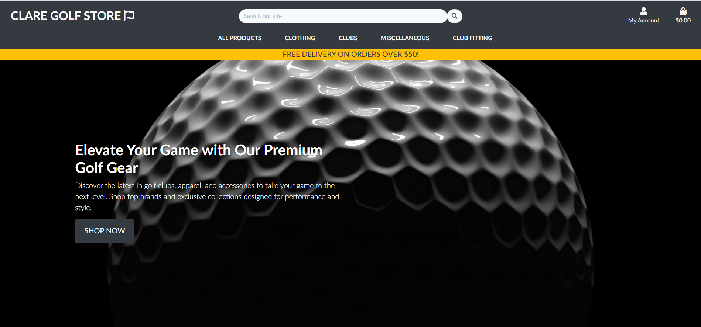
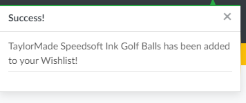
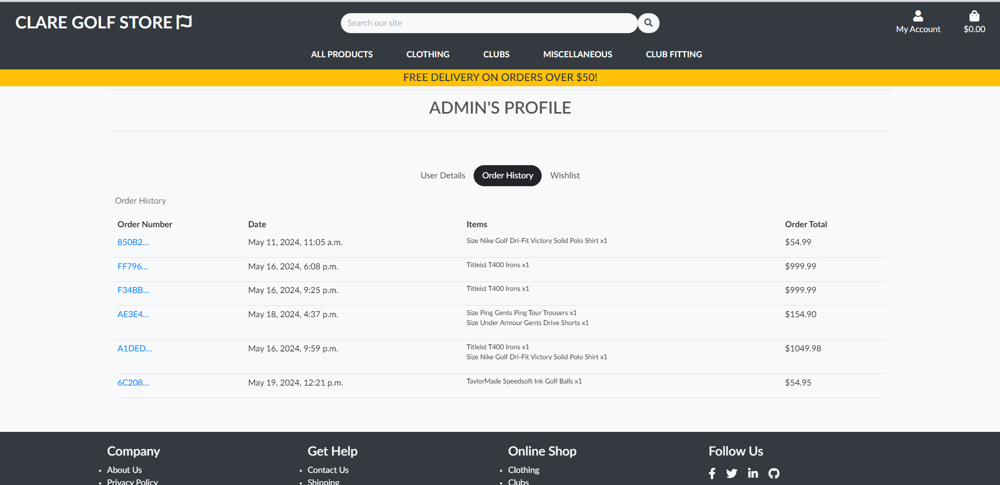

# **Clare Golf Store**


For my final portfolio project, I chose to create Clare Golf Store as a mix of two of my greatest passions: golf andmy new found one coding. Having played golf since a young age, I have always been captivated by the sport. This lifelong enthusiasm for golf naturally sparked the idea of a specialized store that caters to golfers’ needs, from beginners to seasoned players. Recently, I discovered a new passion for coding, enthralled by the creative and problem-solving aspects it involves. Merging these interests, Clare Golf Store became the perfect project to not only showcase my technical skills in web development but also to create a platform that resonates with my deep-seated love for golf. This project represents a harmonious blend of my personal interests and professional growth, aiming to provide a seamless and engaging online shopping experience for golf enthusiasts.
I have learned so much and come so far in the last year of coding and I'm proud to show what I can create.

View the deployed website [here](https://clare-golf-store-e14c88b1e5dd.herokuapp.com/).(Right click to open in new tab!)

## Table of Contents

1. [User Experience (UX)](#user-experience-ux)
    1. [Strategy](#strategy)
        1. [Project Goals](#project-goals)
        2. [Agile planning](#agile-planning)
        3. [Goals Table](#goals-table)
    2. [Scope](#scope)
        1. [User Stories](#user-stories)
    3. [Structure](#structure)
        1. [Database Model](#database-model)
    4. [Skeleton](#skeleton)
        1. [Wireframes](#wireframes)
    5. [Surface](#surface)
        1. [Color Scheme](#color-scheme)
        2. [Typography](#typography)
2. [Marketing](#marketing)
   1. [Search Engine Optimisation](#search-engine-optimisation)
   2. [Business Model](#business-model)
3. [Features](#features)
   1. [General](#general)
   2. [Home Page](#home-page)
   3. [Header](#header)
   4. [Call to action](#call-to-action)
   5. [Newsletter](#newsletter)
   5. [Footer](#footer)
   6. [Products](#products)
   7. [Product Detail](#product-detail)
   8. [Shopping bag](#shopping-bag)
   9. [Profile](#profile)
   10. [Club Fitting](#club-fitting)
   11. [Footer links](#footer-links)
   12. [404 Error](#404-error-page)
4. [Technologies Used](#technologies-used)
    1. [Languages Used](#languages-used)
    2. [Libraries and Frameworks](#languages-and-frameworks)
    3. [Packages / Dependencies Installed](#packages--dependencies-installed)
    4. [Payment Service](#payment-service)
    5. [Cloud Storage](#cloud-storage)
    6. [Tools and Programs](#tools-and-programs)
5. [Testing](#testing)
    1. [Go to TESTING.md]()
6. [Deployment](#deployment)
    1. [How To Use This Project](#how-to-use-this-project)  
    2. [Deployment to Heroku](#deployment-to-heroku)
7. [Finished Product](#finished-product)
8. [Credits](#credits)
9. [Known Bugs](#known-bugs)
10. [Acknowledgements](#acknowledgements)

***

## User Experience (UX)


### Strategy


#### Project Goals

 - Make the site responsive so it is acessible on different devices and screen sizes.

 - Make it easy to read understand and navigate the site.

 - The design and colours used in the site don't take away from the content.

 - Customers are able to register for an account for ease of use over time.

 - Make the process of buying a product easy so anyone can use the website.

 - Make it easy for users to book appointments and also edit/delete them as they wish.

 ***

#### Agile Planning

For this project I tried to learn more about the agile process and methodologies, my last project had comments about how I didn't use it properly or enough.
This time I had 21 user stories in my [github projects](https://github.com/users/JKirkby95/projects/6) in total when I first laid out my plan for this project. I feel like I did a better job with them this time and I can see why they're such a valuable tool.

I deceided to leave the reviews section in the future features as I already had the 3 custom models neccessary for the project.
But I would love to see it implemented in the future. 

This time around I put more detail into each one as seen in the example below:


Below I will show the varies stages of development for these.

Sprint 1


Sprint 2 


Sprint 3


***

#### Goals Table

Goal | Achieved? |
--- | --- | 
Users able to register for an account | Yes |
Users are able to login/logout of the account| Yes |
Users are able to save their details to said account| Yes |
Users can complete a purchase with ease | Yes |
Users can view their order history afterwards | Yes |
Users can view and sort products | Yes |
Users can search for products using the search bar products | Yes |
Users can add products to their wishlist | Yes |
Users can remove products from their wishlist | Yes |
Users are able to make an appointment for club fitting| Yes  |
Users can edit/delete their appointment for club fitting| Yes  |
Users can sign up to our newsletter | Yes |
Users can find links to contact us or view our social media | Yes |
The purpose of the site is obvious immeadiatly | Yes |
The site has a responsive design to suit plenty of screen sizes |  Yes |
All forms on the site are validated and give clear feedback for errors |  Yes |
Review system in place for products |  No (future feature) |

[Back to top ⇧](#clare-golf-store)

***

### Scope

#### User Stories

As it was my first time making an ecommerce site , my user stories are not in th best order, In the future I feel like instead of typing them straight into the [github projects](https://github.com/users/JKirkby95/projects/6) i will actually start on a piece of paper to get them in the correct order.

**User Story 1**
- View list of products
    - As a user I would like to see a clear list of products so it's easy for me to make a purchase.
    - This is a huge part of the store for me, I wanted the products to look great and it be very clear what they are.

**User Story 2**
- View product details
    - As a user I would like to see more details about each product to help me make my decision.
    - This again seemed like a massive part of a store to me , you need  to give the customer all the information they'd need to want to purchase the item.

**User Story 3**
- Shopping bag
    -As a user I want to be able to view the items in my shopping bag and see the total cost.
    - I wanted it to be very clear to the user what was in their bag and what it actually was going to cost them.

**User Story 4**
- Register for an account
    - As a user I want to be able to register for an account.
    - This is absolutely neccessary for me, I find I use sites more personally that have an account where all my details are saved. It makes the whole process so much smoother.

**User Story 5**
- Login
    - As a user I want to be able to login to my account.
    - Straight forward one really you need to be able to login if youre going to be accessing the site from multiple devices.

**User Story 6**
- Logout
    - As a user I want to be able to logout of my account.
    - Again this is abolutely neccessary to protect the user.

**User story 7**
- Have a profile
    - As a user I want to be able to make a user profile to store my personal details.
    - I love this feature like I said before, it makes everything so easy it's the main reason I use sites like amazon so much.

**User story 8**
- Sort Products
    - As a user I want to be able to sort the products depending on what I'm searching for.
    - This makes it much easier for the user to identify what they want and to view all the options in that price range or a certain brand.

**User story 9**
- Product Categories
    - As a user I want to be able to search for products by categories.
    - On a site like this that has so many products categories are essential, it means the user can only search throught the products they want to see.

**User story 10**
- Adjust bag
    - As a user I want to be able to adjust the items in my shopping bag.
    - This is needed if the user adds too much of one product or adds a product they didn't want to add in the first place.

**User story 11**
- Payment info
    - As a user I want to be able to easily enter my payment information.
    - Stripe was used for this the built in validation is fantastic makes the whole process so easy.

**User story 12**
- Order Confirmation
    - As a user I want to be able to see an order confirmation after my order is placed.
    - This was used to show the customer a receipt of their purchase and an order number to view thier order history.

**User story 13**
 - Add a product
    - As an admin I want to be able to add products to the store.
    - This is possible on this site either through the admin or the product management tab but this is ONLY for admins.

**User story 14**
- Edit/Update products
    - As an admin I want to be able to edit a product or update some features about it.
    - Again this feature is only available to the admin, but is a great feature if you wanted to update a prodicts price or details.

**User story 15**
- Delete a product
    - As an admin I want to be able to delete a product from the store.
    - This is an admin only feature again, it's needed if a product becomes obselete.

**User story 16**
- Make an order
    - As a user I want to be able to make an order.
    - The main point of the site really, again stripe helped massively with this.

**User story 17**
- wishlist
    - As a user I want to be able to add items to my wishlist.
    - This is yet another great feature that comes with having an acoount with us,
    you can keep a product in their until it drops in price or you decide to buy it anyway.

**User story 18**
- Contact Form
    - As a user I want to have a contact form available to make out of business hours requests.
    - This is great for any feedback or queries a customer has.

**User story 19**
- Reviews
    - As a user I want to be able to leave or view reviews of the store.
    - I didn't get to add this feature but it's one I'd love to add. It could be attached to any product the pros who do the club fitting or the site in general.

**User story 20**
- Newsletter
    - As a user I want to be able to sign up to a newsletter to receive future offers.
    -  This is great for the site owner and the customer the user receives upcomign special and deals.

**User Story 21**
- Club Fitting
    - As a user I want to be able to make an appointment for a club fitting.
    - This ad's a luxury feature to any golf store and also ads crud functionality to the website for the user.

[Back to top ⇧](#clare-golf-store)

*** 

### Structure

***

#### Database Model

I made this database model using [lucid chart](https://lucid.app/), it was my first time using anything like this to create a database diagram. I tried to show all the links between the certain elements of this website.


### Skeleton

#### Wireframes

I made these wireframes using [lucid chart](https://lucid.app/) also, I found them very easy to use although in future I would probably buy a membership for balsamiq as I prefer the look of their wireframes.

Page | Wireframe
--- | --- 
Home |  |
Products|  |
User Profile |  |
Club Fitting |  |
Shopping Bag | 

[Back to top ⇧](#clare-golf-store)


### Surface

#### Color Scheme

The color scheme for this site was meant to be easy on the eye and not take away from the content, the main colors I used was the bootstrap dark and light class.
I used light over white so it's not quite as harsh on the eyes, and I'm personally a fan of the boostrap dark it's very clean color and lets any products with color pop.


#### Typography

The font used for this site is Nunito.

Nunito is an excellent choice for your website's font due to its modern, clean, and highly readable design. As a sans-serif typeface, it provides a sleek and contemporary aesthetic that enhances the visual appeal of your site.

***

## Marketing


### Search Engine Optimisation

To enhance the search engine optimization (SEO) performance of the website, I had to research what words we should inlcude in the meta tags. The aim was to identify relevant keywords to optimize the seo performance of the site.

Several search terms such as 'golf equipment,' 'golf accessories,' and 'club fittings' were analyzed to uncover popular keywords. From this analysis, a selection of both short and long-tail keywords was made and incorporated into the head element of the base.html template.

The chosen keywords include:

Golf clubs
Golf equipment
Golf accessories
Golf fittings
Golf apparel
Golf bags
Golf balls
Golf gloves
Golf technology

Based on this analysis, adjustments may be made to the keyword selection to refine and improve SEO performance over time. By continuously refining these keywords, the website aims to achieve higher rankings on search engines like Google.


### Business Model

**Introduction**

Clare Golf Store operates as both a physical and online retail platform specializing in high-quality golf equipment, accessories, and fittings. Established initially as a brick-and-mortar store, the business has transitioned to an omnichannel model to reach a broader customer base. This section outlines our business strategy, including key initiatives and considerations.

**Online Presence**

To expand our reach beyond our local market, we've established a strong online presence through our website and social media platforms. We've created a Facebook page to engage with customers, share updates, and promote products. Additionally, our website serves as an e-commerce platform, offering customers the convenience of shopping from anywhere.


**Strengths**

- Diverse Product Range: We offer a comprehensive selection of golf equipment, accessories, and fittings, catering to golfers of all skill levels.

- Omnichannel Approach: By combining our physical store with an online presence, we provide customers with multiple touchpoints for purchasing products.

- International Shipping: We ship to the UK, US, Canada, and Ireland, allowing us to tap into global markets and reach a wider audience.

- Expertise and Customer Service: Our knowledgeable staff provide expert advice and personalized service, enhancing the overall customer experience.

**Weaknesses**

- Market Competition: The golf industry is highly competitive, with numerous established brands and retailers competing for market share.

- Shipping Costs and Logistics: International shipping can be costly and complex, impacting profit margins and delivery times.

- Brand Recognition: As a relatively new player in the online space, building brand awareness and trust among online customers is an ongoing challenge.

**Future Growth Opportunities**

- Expansion of Product Offerings: We plan to expand our product range to include additional golf-related categories such as apparel, training aids, and technology.

- Enhanced Digital Marketing: Investing in targeted digital marketing campaigns to increase brand visibility and attract new customers.

- Customer Loyalty Programs: Implementing loyalty programs and incentives to encourage repeat purchases and foster customer loyalty.

- Partnerships and Collaborations: Exploring strategic partnerships with golf clubs, instructors, and other industry players to expand our reach and customer base.

**Conclusion**

Clare Golf Store is committed to delivering exceptional products and services to golf enthusiasts worldwide. With a strong emphasis on quality, expertise, and customer satisfaction, we strive to become a leading destination for all golfing needs, both online and offline.

***

## Features

### General

- This website was designed to be completely responsive, with bootstrap cols and rows being the base.

### Home Page



- This is what users see when the first load up the website, I wanted it to be very clear what this websites main purpose is immeadiatly on landing.

### **Header**


- The header on this site is meant to be clean and easy to navigate.
    - The logo on the left acts as a home button.
    - The search bar to find products with a key word.

### **Call to action**


- The call to action section makes it easy for customers to view all available products.

### **Newsletter**


- The newsletter is placed at the bottom of the home page and is run by mailchimp.

### **Footer**


- The footer here is very simple a lot of sites I found while researching had very cluttered footers.

### **Products**


- One of my favourite sections to design was this products section, I'm a big fan of the white card and the product adds the color.

### **Product detail**


- Similar to the products page I love the way the product itself adds the color to the site.

- When the heart on the page is click it adds a product to the wishlist as seen by the message below.



### **Shopping Bag**


- This is designed to be very easy to read and navigate to the checkout.

### **Profile** 


- The user profile uses tabs to go through each section it was my first time designing a page this way and I love the idea of it.

### **Club Fitting**


-  This is the club fitting booking section, it contains a form and some info about the process.
- Here you can also see the appointment card I created and what happens if the user has no appointments created.

### **Footer links**

- I provided some links in the footer to replicate the kind of links you'd expect to be on a real online golf store.


### **404 Error page**


- I also created pages for error 500 and 403 with a link to return to the home page.

[Back to top ⇧](#clare-golf-store)

***

## Technologies Used

### Languages Used

-[HTML5](https://en.wikipedia.org/wiki/HTML)
-[CSS3](https://en.wikipedia.org/wiki/CSS)
-[JavaScript](https://en.wikipedia.org/wiki/JavaScript)
-[Python](https://en.wikipedia.org/wiki/Python_(programming_language))

***

### Libraries and Frameworks

-[Django](https://www.djangoproject.com/)   
    -Django was used as web framework.

-[Django Template](https://jinja.palletsprojects.com)  
    -Django Template was used as a templating language for Django to display backend data to HTML.
   
-[Bootstrap 4](https://getbootstrap.com/docs/4.0/getting-started/introduction/)  
    -Bootstrap 4 was used throughout the website to help with styling and responsiveness.

-[Google Fonts](https://fonts.google.com)  
    -Google fonts were used to import the fonts into the html file and were used on all parts of the site.

-[Font Awesome](https://fontawesome.com)  
    -Font Awesome was used throughout the website to add icons for aesthetic and UX purposes. 

-[JQuery](https://jquery.com/)
    - JQuery was used to help writing less javascript code

***

### Packages / Dependencies Installed

- [Django Allauth](https://docs.allauth.org/en/latest/)
    - -Django Allauth was used for user authentication, registration, and account management.

- [Django Crispy Form](https://django-crispy-forms.readthedocs.io/en/latest/)
    - Django cripsy forms were used to control the rendering of the forms. 

- [Django Countries](https://pypi.org/project/django-countries/)
    - Django Countries was used to provide country drop down for the profile and chackout apps.

- [Pillow](https://pypi.org/project/Pillow/)
    - Pillow was used to add image processing capabilities.  
 
- [Gunicorn](https://gunicorn.org/)
    - Gunicorn is a Python WSGI HTTP Server for UNIX.

***

[Back to top ⇧](#clare-golf-store)

### Payment Service
- [Stripe](https://docs.stripe.com/)
    - The Stripe Python library provides an interface to interact with Stripe's API, enabling developers to integrate payment processing functionalities into their Python applications.

***

### Cloud Storage

-[Elephantsql](https://www.elephantsql.com)
    -Elephantsql was used to help host the Postgres database with Heroku

-[Cloudinary](https://cloudinary.com/)
    -Cloudinary was used to store all static files for this project

***

### Tools and Programs

-[GitPod](https://gitpod.io/)
     -GitPod was used for writing code, committing, and then pushing to GitHub.

-[GitHub](https://github.com)  
   GitHub was used to store the project's code after being pushed from Git. 

-[Heroku](https://www.heroku.com)   
    -Heroku was used to deploy the website.

-[Elephantsql](https://www.elephantsql.com)
    -Elephantsql was used to help host the Postgres database with Heroku.

-[Am I Responsive](ami.responsivedesign.is)  
    -Am I Responsive was used to preview the website across a variety of popular devices.

-[Chrome DevTools](https://developer.chrome.com/docs/devtools/)
    -Chrome DevTools was used during development process for code review and to test responsiveness.

-[W3C Markup Validator](https://validator.w3.org/)
    -W3C Markup Validator was used to validate the HTML code.

-[W3C CSS Validator](https://jigsaw.w3.org/css-validator/)
    -W3C CSS Validator was used to validate the CSS code.

-[JSHint](https://jshint.com/) 
    -The JSHints JavaScript Code Quality Tool was used to validate the site's JavaScript code.

-[Lucid Chart](https://lucid.app/)
    - Lucid Chart was used to build the wireframes and database diagrams for this project.

[Back to top ⇧](#clare-golf-store) 

## Testing

### Lighthouse

- The lighthouse test results for each page can be found below:

Home


***

Products Page


***

Product Details Page


***

Club Fitting Page


***

Appointments Page


***

Edit Appointments Page


***
Shoppping Bag Page


***

Checkout Page


***

Order Confirmation Page


***

Profile Page


***

About us


***

Privacy Policy


***

Contact Us Page


***

Shipping Page


***

Payment options page


***

### Code Validtion

### HTML


- All HTML pages were validated using [W3C Markup Validator](https://validator.w3.org/).

***

### CSS


- My CSS was validated using [Jigsaw CSS Validator](https://jigsaw.w3.org/css-validator/)

### Javascript


- My Javascript was validated using [JSHint](https://jshint.com/).

***

### Python 


- The PEP8 tool provided by Code Institute was used to validate my python link to which is [here.](https://pep8ci.herokuapp.com/)


***

### Manual Testing

**Browser Compatibility**

Browser | Outcome | Pass/Fail  
--- | --- | ---
Google Chrome | No appearance, responsiveness or functionality issues.| Pass
Safari | No appearance, responsiveness or functionality issues. | Pass
Brave | No appearance, responsiveness or functionality issues. | Pass
Microsoft Edge | No appearance, responsiveness or functionality issues. | Pass
Firefox Developer | No appearance, responsiveness or functionality issues. | Pass


**Device compatibility**

Device | Outcome | Pass/Fail
--- | --- | ---
HP Pavillion 14" display | No appearance, responsiveness or functionality issues. | Pass
Custom Home PC with 28" display  | No appearance, responsiveness or functionality issues. | Pass
MSI Katana GF66 11UE | No appearance, responsiveness or functionality issues. | Pass
Iphone 14 Pro | No appearance, responsiveness or functionality issues. | Pass
Nothing Phone (1) | No appearance, responsiveness or functionality issues. | Pass
One Plus 8T| No appearance, responsiveness or functionality issues. | Pass
Ultra wide monitor | Some appearance issues, but functionality all good | Fail (something to note for my next project)

**Common Elements Testing**

- General

    Feature | Outcome | Pass/Fail
    --- | --- | ---
    Nav links |  Links are working as expected. | Pass
    Call to action | Opens all products page as expected | Pass
    Search bar | searches the full products database and returns results | Pass 
    Account button | Opens dropdown for the users account | Pass
    Bag button | Opens the uses current bag | Pass
    Logo link | sends users back to the  home page | Pass
    Delivery banner animation | switches between the two lines of text as expected | Pass
    Newsletter sign up | Gives the user a notifcation and users email is seen on mailchimp as a result | Pass
    Footer links | Working as expected, social links open in a new tab | Pass
    Sign up | Working as expected, and redirects user page for email confirmation| Pass
    Email confirmation | Confirms users email and allows them to log in| Pass
    Log in | Logs user in , password and username must be correct so validation is working | Pass
    Sign out | Working as expected, hides features for logged in users| Pass
    Reset password | Sends user the email link to reset in good time and works as expected | 
    Products Sorting | Sorting products by category, price ,name and rating all work correctly | Pass
    Products home link | Loads the all products page as it should | Pass
    Wishlist button on products page | Add's product to users wishlist as expected | Pass
    Product Cards | Hover effect and reponsive code from Boutique ado walkthrough work as expected | Pass
    Back to top button | Works as expected and will take the user back to the top of the products page | Pass
    Product details wishlist | Add's product to users wishlist as expected | Pass
    Product details buttons | keep shopping button and add to bag work as expected | Pass
    Product details quantity buttons | Currently not working as expected both buttons add the product to the bag | Fail further testing needed
    Product details quantity text box | This feature does work as expected so the user can still adjust the quantity | Pass
    Add to bag message | Displays the current bag and if neccessary the delivery threashold got to check button on this also works. | Pass
    Bag quantity buttons | working as expected, decrement is disabled when value is 1. Update and remove buttons work. | Pass
    Bag buttons | keep shopping button and secure checkout as expected | Pass
    Bag total | Bag displays the correct grand total of the order | Pass
    Checkout Form | fills in details already provided by the user | Pass
    Checkout Form validation | I required fiels is not filled out the from will not submit | Pass
    Card validation | Stripe need a valid card number or date, correct error shows below the card input field | Pass
    Checkout Form Save | Saves details to the users profile ad expected | Pass
    Checkout Form buttons | Adjust bag and complete order buttons work as expected | Pass
    Order Confirmation page | Shows order details and the keep shopping button works as expected | Pass
    Booking form | Form works as expected shows list of all available clubs and Fitters | Pass
    Booking form validation | All fields must be required for the form to process | Pass
    Booking form buttons | Both buttons work as expected | Pass
    Appointments Page | Appointment details show as expected edit/delete buttons also working | Pass
    Appointments page header | Shows user name at the top | Pass
    Appointment security | Working as expected, prevents other users from editing appointments not created by them. | Pass
    Profile page | User details save and are displayed correctly | Pass
    Profile page | Update information button works as expected | Pass
    Profile page | Order history is correct and the links to the order confirmation number work as expected | Pass
    Profile page | User details save and are displayed correctly | Pass
    Wishlist | Wishlist is displayed correctly user can click the product to go to the product details page | Pass
    Wishlist | The remove from wishlist button and the javascript text for it work as expected | Pass
    About us | Map displays correctly and in the right location | Pass
    Privacy Policy | Page displays correctly and the contact button sends the user to the contact us form | Pass
    Shipping | Page displays correctly and the contact button sends the user to the contact us form | 
    Payment Options | Page displays correctly and the contact button sends the user to the contact us form | Pass
    Contact Us Form | Form works as expected and is displayed correctly | Pass
    Contact Us From Validation | From validation works as expected, the name ,email and message fiels are required. The last field is NOT. | Pass
    Contact Us form backend | The form sends the correct data to the django admin and elephant sql database | Pass


## Deployment

### How To Use This Project
To use and further develop this project you can clone the repository.  


- To clone a GitHub project for future use, follow these steps:

    - 1. **Find the Repository**: Go to the GitHub repository page of the project you   want to clone. You can search for repositories using GitHub's search feature.

    - 2. **Clone the Repository**: On the repository page, click on the "Code" button. This will reveal a URL. Copy the URL to your clipboard.

    - 3. **Open Terminal (or Command Prompt)**: Open your terminal or command prompt on your local machine.

    - 4. **Navigate to the Directory**: Use the `cd` command to navigate to the directory where you want to clone the repository. For example, if you want to clone it into a directory named "projects", you would type `cd projects`.

    - 5. **Clone the Repository**: Once you're in the desired directory, use the `git clone` command followed by the URL you copied earlier. It should look something like this:

    ```bash
    git clone https://github.com/username/repository.git

    - Replace username with the username of the repository owner and repository with the name of the repository.

    -6. **Press Enter**: Press Enter to execute the command. Git will clone the repository from GitHub to your local machine.


    7. **Access the Cloned Repository**: Once the cloning process is complete, you can access the cloned repository in the directory you specified.


- To deploy this page to Heroku from its GitHub repository, the following steps were taken:

### Deployment to Heroku

1. Create the Heroku App:
     * Select "Create new app" in Heroku.
    * Choose a name for your app and select the location.

2. Prepare the environment and settings.py file:
    * In the Settings tab, click on Reveal Config Vars and copy the url next to DATABASE_URL.
    * In your GitPod workspace, create an env.py file in the main directory. 
    * Add the DATABASE_URL value and your chosen SECRET_KEY value to the env.py file.
    * Add the SECRET_KEY value to the Config Vars in Heroku.
    * Update the settings.py file to import the env file and add the SECRETKEY and DATABASE_URL file paths.
    * Update the Config Vars with the Cloudinary url, adding into the settings.py file also.
    * The config vars for the EMAIL_HOST_PASS and EMAIL_HOST_USER also have to be added this time around.
    * In settings.py add the following sections:
        * Cloudinary to the INSTALLED_APPS list
        * STATICFILE_STORAGE
        * STATICFILES_DIRS
        * STATIC_ROOT
        * MEDIA_URL
        * EMAIL_HOST_PASS
        * EMAIL_HOST_USER
        * DEFAULT_FILE_STORAGE
        * TEMPLATES_DIR
        * Update DIRS in TEMPLATES with TEMPLATES_DIR
        * Update ALLOWED_HOSTS with ['app_name.heroku.com', 'localhost']

3. Store Static and Media files in Cloudinary and Deploy to Heroku:
    * Create three directories in the main directory; media, static and templates.
    * Create a file named "Procfile" in the main directory and add the following:
        * web: gunicorn project-name.wsgi
    * You will have to run the collectstatic cmd before you deploy for the css to be applied.
    * Go to the Deploy tab on Heroku and connect to GitHub, then to the required repository.
    Click on the Deploy Branch and wait for the build to load. When the build is complete, the app can be opened through Heroku.

[Back to top ⇧](#clare-golf-store) 

***

## Finished Product

| Page        | Desktop         | Mobile |
|-------------|------------------|------------------|
| Home        |  |  |
| Products   |  |    |
| Product Detail |  |   |
| Club Fitting |  |      |
| Appointments   |  |    |
| No appointments|   |    |
| Edit Appointments |  ||
| Contact Us|  | |
| User Details |  |   |
| Order History  |   |    |
| Wishlist |  |   |
| Bag |   |   |
| Checkout |  |  |
| Order Confirmation |  |   |
| About Us |  |  |
| Privacy Policy |  |   |
| Shipping |  |  |
| Payment |   |  |

[Back to top ⇧](#clare-golf-store) 

***


## Credits

- I'd actually like to credit my local golf club here in shannon they gave some advice on what to add to the site.

- Inspiration was taken various users from [Youtube](https://www.youtube.com/).


***

## Known Bugs


## Acknowledgements

- Everyone in the Code Institute Slack community.

- My mentor Marcel, for his fantastic feeback and for breaking this down and making it seem possible for me.

- My family, for allowing me some time to myself to complete this.

